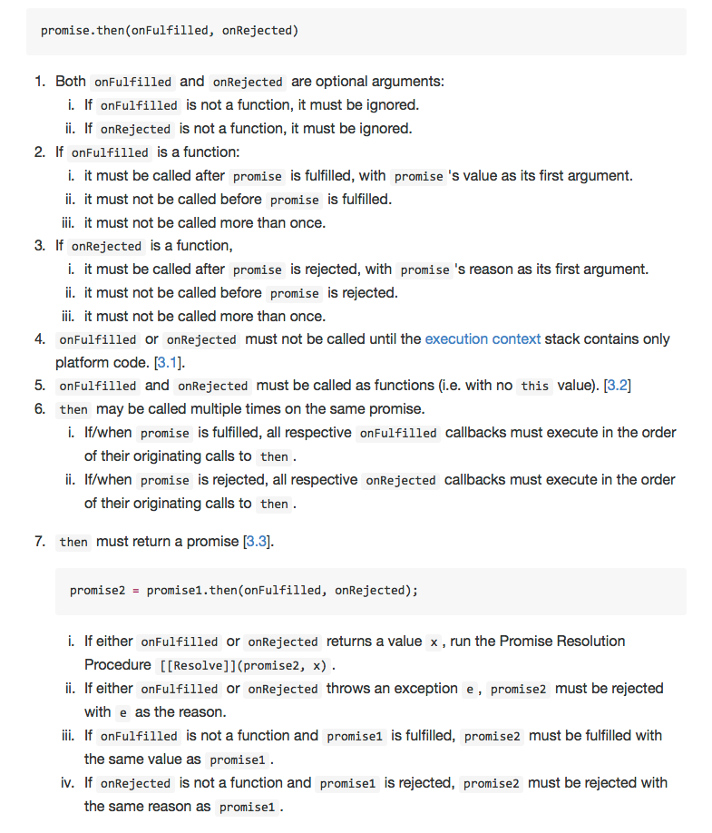
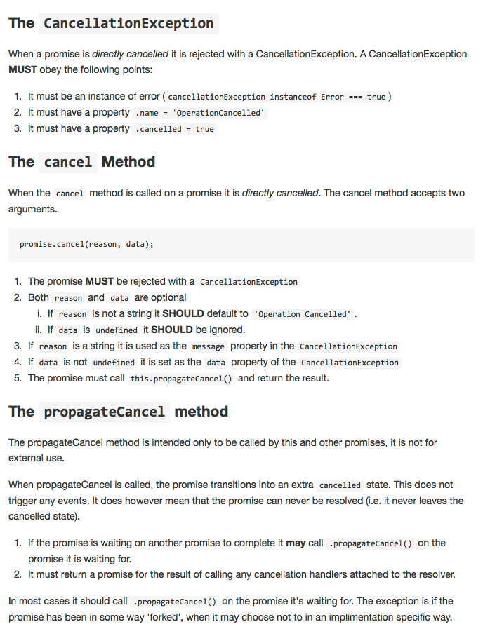
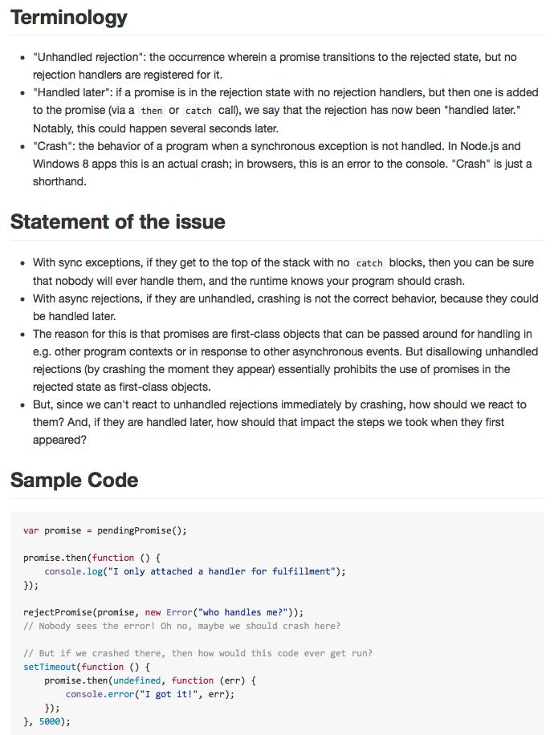

build-lists: true
autoscale: true 

# Principled, Painless Asynchronous Programming in PureScript
### *John A. De Goes* — [@jdegoes](http://twitter.com/jdegoes)
---

## Callback Hell[^1]

```javascript
getData(a, function(b) {
  getData(b, function(c) {
    getData(c, function(d) {
      getData(d, function(e) {
        getData(e, function(f) {
          .
          .
          .
        });
      });
    });
  );
);
```

[^1]: That's *without* error handling!

--- 


## What about Promises/A+?





---

## Introducing Aff[^2]

```haskell
do 
  b <- getData a
  c <- getData b
  d <- getData c
  e <- getData d
  .
  .
  .
```

[^2]: That's with error handling *baked in*!

---

## purescript-aff

* Asynchronous programming shouldn't look any different than synchronous programming (`Eff` / `Aff`).
* Asynchronous primitives should be few in number, low-level, and have principled semantics.
* Errant code should not take down the whole application.
* Performance should be very good, better than alternative Javascript libraries.

---

# Aff eff a

## An asynchronous computation with effects '`eff`' that will yield a value of type '`a`' or terminate with an '`Error`'.

---

# Under the Hood

```haskell
ajaxGet :: forall eff. String -> Aff (ajax :: AJAX | eff) Response
```

```javascript
function ajaxGet(url) {
  return function(success, failure) {  // <- Aff!
    ...
    return canceler;
  };
}
```

---

# Small but Rich API

* **13 Instances**: `Semigroup`, `Monoid`, `Functor`, `Apply`, `Applicative`, `Bind`, `Monad`, `MonadEff`, `MonadError`, `Alt`, `Plus`, `Alternative`, `MonadPlus`.
* **9 Functions**: `runAff`, `launchAff`, `makeAff`, `forkAff`, `attempt`, `apathize`, `later`, `later'`, `finally`.

---

# Pure Aff

```haskell
pure 42
```

---

# Sequential Composition

It's the same as `Eff`: looks & acts like synchronous code.[^3]

```haskell
do 
  b <- Ajax.get a
  c <- Ajax.get b
  ...
```

[^3]: See also, Haskell's `IO`. Sync/async is an implementation detail!

---

# Delayed Computation

Delaying a computation does not add effects, since the fact the computation is asynchronous is already captured in `Aff`.


```haskell
do
  a <- later       $ pure 42
  b <- later' 1000 $ pure 58
  return $ a + b
```

---

# Running an Aff

To *run* an `Aff`, you must supply callbacks to handle success and failure cases.

```haskell
main = do
  runAff (const $ trace "Oh noes!")       -- failure
         (\v -> trace "Got value: " ++ v) -- success
         (pure 42)
```

---

# Launching an Aff

To *launch* an `Aff`, you needn't supply anything, but both value and errors will be discarded.

```haskell
main = do
  launchAff $ pure 42
```

---

# Converting from Callbacks

```haskell
type Ajax eff = (ajax :: AJAX | eff)

ajaxGet0 :: forall eff.
  String 								-- url
  (Error    -> Eff (Ajax eff) Unit) ->  -- error callback
  (Response -> Eff (Ajax eff) Unit) ->  -- success callback
  Eff (Ajax eff) Unit
  
ajaxGet :: forall eff. String -> Aff (Ajax eff) Response
ajaxGet url = makeAff $ ajaxGet0 url
```

---

# Converting from Eff

Lifted `Eff` computations are run immediately; `Aff` is a *strict* superset of `Eff`.

```haskell
main = do
  liftEff $ trace "hello world!"
```

---
# Errors

```haskell
attempt :: forall eff a. Aff eff a -> Aff eff (Either Error a)

method1 = do
  either <- attempt doX 
  case either of
    Left  err -> doY
    Right val -> pure val
    
method2 = doX <|> doY -- if first fails, tries second    

method3 = catchError (throwError $ error "Oh noes!") (const $ pure 42)

```

---

# Forking

Forking is *like* spawning a separate thread for computation.[^4]

```haskell
do 
  forkAff $ later (trace "makes jack a dull boy")
  liftEff $ trace "All work and no play"
```

[^4]: Except, of course, Javascript has no threads, but the effect (affect?) is the same. :smile:

---

# Killing a Forked Computation


```haskell
do 
  c <- forkAff $ later (trace "You'll never see this")
  _ <- cancel c (error $ "Cause")
  liftEff $ trace "But you will see this!"
```

---

# AVar

`AVar` lets you communicate between 'threads'.

```haskell
do
  v <- makeVar
  forkAff (later $ putVar v 1.0)
  a <- takeVar v 
  trace ("Success: Value " ++ show a)
```

---

# Par

`Par` lets you trade `Bind` for parallel composition.

```haskell
do
  Tuple a b <- runPar (Tuple <$> Par (Ajax.get "http://foo.com") <*> 
                                 Par (Ajax.get "http://bar.com"))

  first     <- runPar (Par (later' 100 $ pure "First") <|> 
                       Par (later' 200 $ pure "Second"))
```

---

# AStream

*Coming Soon*

 * Asynchronous streams that compose in parallel
   * Effectful or pure sources
   * drop, take, zip, etc.

---

# Aff Ecosystem

A growing number of libraries & projects use `Aff`.

 * purescript-affjax
 * purescript-halogen
 * purescript-wai
 * purescript-rx
 * purescript-any-db
 * purescript-node-postgres
 * purescript-node-mongodb
 * purescript-routing
 * purescript-spec
 * giflib-web
 * gulp-purescript
 * purefn/naggy

### YOUR LIBRARY HERE

---

# THANK YOU
### *Follow me @jdegoes*