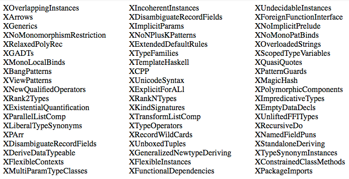

autoscale: true 

# The Next Great Functional Programming Language
### (OK, not *really*.)
### John A. De Goes — @jdegoes

---

## ML - 1973
## Haskell - 1990[^1]
## OCaml - 1996[^2]

[^1]: Or 1985 *if* you count Miranda.

[^2]: Or 1987 *if* you count Caml.

---

# Haskell



---

# Haskellz
### 144 quadrillion flavors.
## 😱

---

# Our Best FPLs Suffer from Decades Worth of Accretion

---

# Individual Features were Designed, but the FPLs *Came Into Existence*

---

# What Would a *Designed* FPL Look Like Today?

---

# ?


---

# :broken_heart:


---

#### [This Slide Intentionally Left Blank]

---


# My Ideal FPL

 * ~~Pattern Matching~~
 * ~~Records~~
 * ~~Modules~~
 * ~~Syntax~~
 * ~~Type Classes~~
 * ~~Nominative Typing~~
 * ~~Data~~
 * ~~Recursion~~

---

# :-1: Pattern Matching

--

---

# Pattern Matching

```haskell
 import Lens.Family.Total
 import Lens.Family.Stock

 total :: Either Char Int -> String       -- Same as:
 total = _case                            -- total = \case
     & on _Left  (\c -> replicate 3  c )  --     Left  c -> replicate 3 c
     & on _Right (\n -> replicate n '!')  --     Right n -> replicate n '!'
```

---

# :-1: Records

--

---

# Records

```scala
val book =
  ("author" ->> "Benjamin Pierce") ::
  ("title"  ->> "Types and Programming Languages") ::
  ("id"     ->>  262162091) ::
  ("price"  ->>  44.11) ::
  HNil

scala> book("author")  // Note result type ...
res0: String = Benjamin Pierce

scala> val extended = book + ("inPrint" ->> true)  // Add a new field
extended: ... complex type elided ... =
  Benjamin Pierce :: Types and Programming Languages :: 262162091 :: 46.11 :: true :: HNil

scala> val noId = extended - "id"  // Removed a field
noId: ... complex type elided ... =
  Benjamin Pierce :: Types and Programming Languages :: 46.11 :: true :: HNil
```

---

# :-1: Modules

--

---

# Modules

```SML
structure ListStack :> STACK =
struct
  type t = 'a list
  [...]
end
```

---

# Modules

```haskell

data Stack f = Stack
  { makeNew :: forall a. f a,
    push    :: forall a. a -> f a -> f a,
    pop     :: forall a. f a -> Maybe (Tuple a (f a)) }
    

doSomeStackStuff :: forall f. Stack f -> Thing
```

---

# Modules

```haskell

data Stack f = Stack
  { makeNew :: forall a. f a,
    push    :: forall a. a -> f a -> f a,
    pop     :: forall a. f a -> Maybe (Tuple a (f a)) }

data ReservationSystem f = ReservationSystem
  (forall g. Stack g -> { ... })
```

---

# :-1: Syntax

--

---

# Syntax
### Let's stop pretending programs are  strings of ASCII characters.

* ~~implicits~~
* ~~order of function parameters / application~~
* ~~compiler errors~~
* ~~funky looking operators~~
* ~~scopes~~
* ~~Haskell-style (fake) modules & imports~~
* ~~name clashes~~
* ~~information elision~~
* ...


---

# :-1: Type Classes

--

---

# Type Classes
### Just 'records' with compiler-enforced laws.[^3]

[^3]: Type classes also add an implicitly applied `(a : Type) -> TypeClass a` function that's piecewise-defined, but that's just syntax.

---

# :-1: Partiality

--

---

# Partiality
### If it's partial, it's not a &^@#% function.

---


# :-1: Nominative Typing

--

---

# Nominative Typing

```haskell
data Email = Email String

data DOMId = DOMId String

data Positive = Positive Float

data Negative = Negative Float

data DressSize = DressSize Float
```

---

# Nominative Typing

```haskell
data ??? = ??? String

data ??? = ??? String

data ??? = ??? Float

data ??? = ??? Float

data ??? = ??? Float
```

---

# Let's Stop Pretending Differences in *Names* Actually Matter

---

# Nominative Typing
### Let's play a guessing game.

```haskell
data ??? = ??? -- {v: Float | v > 0}

data ??? = ??? -- {v: Float | v < 0}
```

---

# :-1: Data

--

---

# Data
### Data: Bits-based description.

```haskell
data Either a b = Left a | Right b
```
```c
struct either {
  int tag;
  union {
    void *left;
    void *right;
  };
};
```

---

# Data
### Newbies: addicted to pattern matching.

```haskell
data List a = Nil | Cons a (List a)

doSomething :: forall a. List a -> Int
doSomething Nil        = 0
doSomething (Cons _ l) = 1 + doSomething l
```

---

# Data
### Pros: addicted to folds.

```haskell
fold :: forall z a. z -> (z -> a -> z) -> List a -> z
fold z _ Nil = z
fold z f (Cons a l) = fold (f z a) l
```

---

# Data
### Folds: Capability-based description.

```haskell
fold :: forall z a. z -> (z -> a -> z) -> List a -> z

data List a = List (forall z. z -> (z -> a -> z) -> z)
```

---

# Data

```haskell
data List a = List (forall z. z -> (z -> a -> z) -> z)

nil              = \z f -> z
cons a (List as) = \z f -> as (f a z) f
```

### Array? Linked List? Vector? Skip List?[^4]

[^4]: Strictly more powerful than a `data List` (pros & cons).

---

# :-1: Recursion

--

---

# Recursion
### Goto of functional programming.[^5]

```haskell
f x = if x / 2 > x then g (2 * x) else 42
g x = if x % 1 == 0 then f (g (x + 1)) else h (x - 1)
h x = if x % 1 == 1 then f (x * 2 + 1) else g (x + 1)
```

[^5]: What's hard for a `machine|human` to understand is also hard for a `human|machine` to understand.

---

# Recursion
### Induction -> Folds.

---

# Recursion
### Coinduction -> State Machines.

```haskell
type Machine s a b = (s, (s, a) -> (s, b))
```
[^6]

[^6]: Except this is too weakly typed.

---

# My Ideal FPL

--

---

# My Ideal FPL
### Layered like an onion.

 * Turing incomplete for 99% of program
   * Prove / optimize more
 * Turing complete 'driver'
   * Prove / optimize less
   * Possibly in a different language (e.g. Haskell)

---

# My Ideal FPL
### Structured editor.

 * Friendly FP
 * Destroys motivation for most language 'features'

---

# My Ideal FPL
### All the things are values.

 * Math functions
 * Abolish incidental complexity
 * Abolish artificial distinctions

---

# My Ideal FPL
### Proof search.

 * Turing complete
 * Levels of proof
   1. Proven true
   2. Evidence for truth but not proven true
   3. Proven false (in general or by counterexample)
 * Massive, persistent proof databases
 * *Cross-disciplinary* research
   * e.g. deep learning to accelerate proof search

---

# My Ideal FPL
### Zero cost abstraction.

 * As long as we're shooting for the moon
   * (But genuinely easier w/o recursion/data)

---

# Inspirations

 * Unison Programming Language[^7]
 * LiquidHaskell[^8]
 * Morte[^9]

[^7]: <http://unisonweb.org>

[^8]: <http://goto.ucsd.edu/~rjhala/liquid/haskell/>blog/

[^9]: <http://www.haskellforall.com/2014/09/morte-intermediate-language-for-super.html>

---

# THANK YOU
### John A. De Goes — @jdegoes